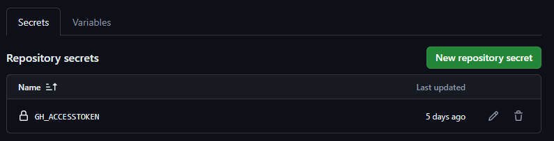
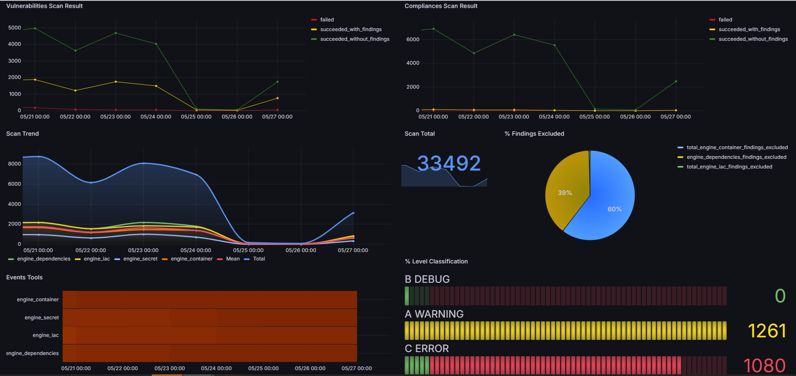
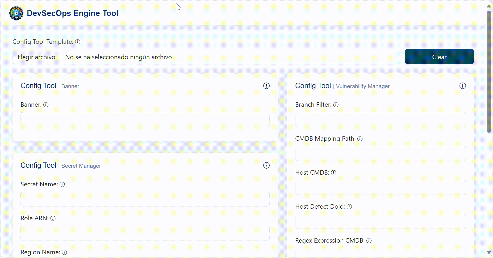

# DevSecOps Engine Tools

[](#)
[](https://github.com/bancolombia/devsecops-engine-tools/actions/workflows/build.yml)
[](https://sonarcloud.io/summary/new_code?id=bancolombia_devsecops-engine-tools)
[](https://sonarcloud.io/summary/new_code?id=bancolombia_devsecops-engine-tools)
[](#)

# Objective

Tool that unifies the evaluation of the different devsecops practices being agnostic to the devops platform, using both open source and market tools.

# Component

📦 [tools](https://github.com/bancolombia/devsecops-engine-tools/tree/trunk/tools): DevSecOps Practice Modules

# Communications channel

Here are the channels we use to communicate about the project:

**1. Mailing list:** You can join our mailing list to always be informed at the following link: [CommunityDevsecopsEngine](https://groups.google.com/g/CommunityDevsecopsEngine)

**2. Email:** You can write to us by email:  MaintainersDevsecopsEngine@googlegroups.com

# Getting started

### Requirements

- Python >= 3.8

### Installation

```bash
pip3 install devsecops-engine-tools
```

### Scan running - flags (CLI)

```bash
devsecops-engine-tools --platform_devops ["local","azure","github"] --remote_config_repo ["remote_config_repo"] --tool ["engine_iac", "engine_dast", "engine_secret", "engine_dependencies", "engine_container"] --folder_path ["Folder path scan engine_iac"] --platform ["k8s","cloudformation","docker", "openapi"] --use_secrets_manager ["false", "true"] --use_vulnerability_management ["false", "true"] --send_metrics ["false", "true"] --token_cmdb ["token_cmdb"] --token_vulnerability_management ["token_vulnerability_management"] --token_engine_container ["token_engine_container"] --token_engine_dependencies ["token_engine_dependencies"] --xray_mode ["scan", "audit"]
```

### Structure Remote Config
[example_remote_config_local](https://github.com/bancolombia/devsecops-engine-tools/blob/trunk/example_remote_config_local/)
```bash
📦Remote_Config
   ┣ 📂engine_core
   ┃ ┗ 📜ConfigTool.json
   ┣ 📂engine_sast
   ┃ ┗ 📂engine_iac
   ┃   ┗ 📜ConfigTool.json
   ┃   ┗ 📜Exclusions.json
   ┃ ┗ 📂engine_secret
   ┃   ┗ 📜ConfigTool.json
   ┣ 📂engine_sca
   ┃ ┗ 📂engine_container
   ┃   ┗ 📜ConfigTool.json
   ┃   ┗ 📜Exclusions.json
   ┃ ┗ 📂engine_dependencies
   ┃   ┗ 📜ConfigTool.json
   ┃   ┗ 📜Exclusions.json
```

#### Tools available for the modules (Configuration engine_core/ConfigTool.json)


<table>
  <tr>
    <th>Module</th>
    <th>Tool</th>
    <th>Type</th>
  </tr>
  <tr>
    <td rowspan="3">ENGINE_IAC</td>
    <td><a href="https://www.checkov.io/">CHECKOV</a></td>
    <td>Free</td>
  </tr>
  <tr>
    <td><a href="https://kubescape.io/">KUBESCAPE</a></td>
    <td>Free</td>
  </tr>
  <tr>
    <td><a href="https://www.kics.io/">KICS</a></td>
    <td>Free</td>
  </tr>
   <tr>
    <td>ENGINE_DAST</td>
    <td><a href="https://projectdiscovery.io/nuclei">NUCLEI</a></td>
    <td>Free</td>
  </tr>
  <tr>
    <td>ENGINE_SECRET</td>
    <td><a href="https://trufflesecurity.com/trufflehog">TRUFFLEHOG</a></td>
    <td>Free</td>
  </tr>
  <tr>
    <td rowspan="2">ENGINE_CONTAINER</td>
    <td><a href="https://www.paloaltonetworks.com/prisma/cloud">PRISMA</a></td>
    <td>Paid</td>
  </tr>
  <tr>
    <td><a href="https://trivy.dev/">TRIVY</a></td>
    <td>Free</td>
  </tr>
  <tr>
    <td rowspan="2">ENGINE_DEPENDENCIES</td>
    <td><a href="https://jfrog.com/help/r/get-started-with-the-jfrog-platform/jfrog-xray">XRAY</a></td>
    <td>Paid</td>
  </tr>
  <tr>
    <td><a href="https://owasp.org/www-project-dependency-check/">DEPENDENCY CHECK</a></td>
    <td>Free</td>
  </tr>
</table>

### Scan running sample (CLI) - Local

> Complete the value in **.envdetlocal** file a set in execution environment
```
$ set -a
$ source .envdetlocal
$ set +a
```


```bash
devsecops-engine-tools --platform_devops local --remote_config_repo DevSecOps_Remote_Config --tool engine_iac

```


### Scan running sample - Azure Pipelines

The remote config should be in a Azure Devops repository.

Note: By default the tool gets the token from the SYSTEM_ACCESSTOKEN variable to get the remote configuration repository. You must ensure that this token has permission to access this resource.

```yaml
name: $(Build.SourceBranchName).$(date:yyyyMMdd)$(rev:.r)

trigger:
  branches:
    include:
      - trunk
      - feature/*

stages:
  - stage: engine_tools
    displayName: Example Engine Tools
    jobs:
      - job: engine_tools
        pool:
          name: Azure Pipelines
        steps:
          - script: |
              # Install devsecops-engine-tools
              pip3 install -q devsecops-engine-tools
              devsecops-engine-tools --platform_devops azure --remote_config_repo remote_config --tool engine_iac
            displayName: "Engine Tools"
        env:
          SYSTEM_ACCESSTOKEN: $(System.AccessToken)

```

### Scan running sample - Github Actions

The remote config should be in a GitHub repository, either public or private.

**If the repository is public:** 

1. The yml file containing the workflow should be configured using the default secret **GITHUB_TOKEN**. 
For more information, refer to [Automatic token authentication](https://docs.github.com/en/actions/security-guides/automatic-token-authentication).

**If the repository is private:** 

1. Create a personal access token with the necessary permissions to access the repository.
2. Add the token as a secret in the GitHub repository.
    

3. Configure the yml file containing the workflow using the created secret.

**Example of the workflow yml:**

```yaml
name: DevSecOps Engine Tools
on:
  push:
    branches:
      - feature/*
env:
  GITHUB_ACCESS_TOKEN: ${{ secrets.GH_ACCESSTOKEN }} #In this case, the remote config repository is private
  # When the remote config repository is public, the secret should be like this: ${{ secrets.GITHUB_TOKEN }}

jobs:
  release:
    runs-on: ubuntu-latest
    steps:
      - uses: actions/checkout@v4
        
      - name: Set up Python
        uses: actions/setup-python@v5
        with:
          python-version: "3.12"

      - name: Set up Python
        run: |
          # Install devsecops-engine-tools
          pip3 install -q devsecops-engine-tools
          output=$(devsecops-engine-tools --platform_devops github --remote_config_repo remote_config --tool engine_iac)
          echo "$output"
          if [[ $output == *"✘Failed"* ]]; then
            exit 1
          fi
```

# Metrics

With the flag **--send_metrics true** and the configuration of the AWS-METRICS_MANAGER driven adapter in ConfigTool.json of the engine_core the tool will send the report to bucket s3. In the [metrics](https://github.com/bancolombia/devsecops-engine-tools/blob/trunk/metrics/) folder you will find the base of the cloud formation template to deploy the infra and dashboard in grafana.



# Config Tool Generator

To generate the ConfigTool.json file in a simple way, a web interface was created where you can configure each necessary parameter individually or use a base template that you want to modify. In the [config tool generator](https://github.com/bancolombia/devsecops-engine-tools/tree/trunk/remote_config_generator/config-tool-generator) folder you will find the code for the SPA created in Angular to run it local environment.



# How can I help?

Review the issues, we hear new ideas. Read more [Contributing](https://github.com/bancolombia/devsecops-engine-tools/blob/trunk/docs/CONTRIBUTING.md)