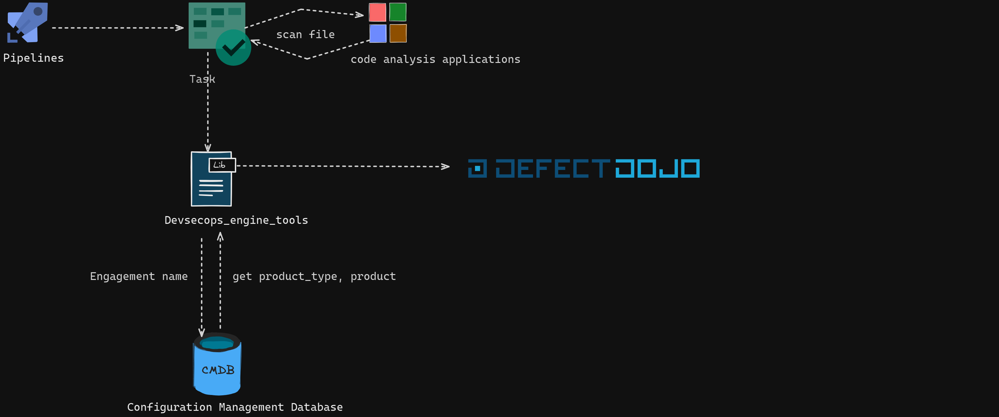

## Defect-Dojo-Lib Documentation

### Architecture

The library communicates with different services, as illustrated in the following diagram:

### Connection Configuration

To send information to Defect-Dojo, it is necessary to create a connection, which can be done using the Connect module. This module exposes functionality to create the connection object with other services integrated into the library.

The DefectDojo module exposes functionalities applicable to the Defect-Dojo app, such as the *send_import_scan* method that ingests data from vulnerabilities reported by external applications.

# Example of Using the Defect-Dojo Module

    import os
    from devsecops_engine_utilities.defect_dojo import DefectDojo, ImportScanRequest, Connect

    path_file = os.path.dirname(os.path.realpath(__file__))

    if __name__ == "__main__":

     request: ImportScanRequest = Connect.cmdb(
        compact_remote_config_url=https://grupotest.visualstudio.com//_git/project?path=/directory/file.json,
        cmdb_mapping={"product_type_name": "","product_name": "nombreapp","tag_product": "nombreentorno","product_description": "","codigo_app": ""}
        personal_access_token="aidfjajia3249ajfdiadjfijtest",
        token_cmdb=settings.2398298jdfa89289uj389jr3atest,
        host_cmdb="http://localhost",
        expression="",
        token_defect_dojo="aijfiadsfoiajtest123",
        host_defect_dojo="http://localhost:8000",
        scan_type="test_file.json",
        engagement_name="ABC_TestCode",
        tags="",
        branch_tag="master",
    )

    response = DefectDojo.send_import_scan(request)

**compact_remote_config_url** : is the URL of the remote file (Azure repository) that must have the specified format.

        "types_product": {
        "engagement_name": "engagement_name_other",
        "engagement_name": "engagement_name_other2",
        }

**cmdb_mapping** is a configuration dictionary to relate keywords from information obtained from CMDB to the information that will be entered into Defect-Dojo. For example:

    [
    {
        "engagement_name_cmdb": "engagement",
        "producto_name_cmdb": "product",
        "product_type_cmdb": "product_type",
        "codigo_app": "test_129342",
    }
    ]

*personal_access_token :* Token generated from an Azure accoun

*token_cmdb :* Token that allows access to CMDB

*expression* :  Regular expression (string) to extract code from the repository.

*token_defect_dojo* : Token generated by Defect-Dojo

*host_defect_dojo* : URL where Defect-Dojo is deployed (for example, http://localhost.com:8000 for local execution).

*scan_type* : Type of scanning or parser of Defect-Dojo to be used

The other parameters are configurable according to your needs and are equivalent to those received by the import_scan endpoint of Defect-Dojo, respecting the naming of the parameters and their data types. If you want to consult more information about the parameters that the method can receive, you can check the official documentation of Defect-Dojo endpoint import_scan [here](https://demo.defectdojo.org/api/v2/oa3/swagger-ui/)

### Example of Sonar API Scan

This library supports the integration of Defect-Dojo via Sonar through API. In this specific case, it is not necessary to specify a file; Defect-Dojo connects to the Sonar API automatically as long as a prior configuration has been made..

- Creation of a tools-configuration:

In the following example, take into account the tools_configurations parameter, which is the object that allows the connection of Defect-Dojo with SonarQube. The expected value is an integer corresponding to the ID of the object in the database.

*IMPORTANTE*

Note that for the tools_configurations parameter, the library takes the default value of 1.

    request: ImportScanRequest = Connect.cmdb(
        compact_remote_config_url=https://grupotest.visualstudio.com//_git/project?path=/directory/file.json,
        cmdb_mapping={"product_type_name": "","product_name": "nombreapp","tag_product": "nombreentorno","product_description": "","codigo_app": ""}
        personal_access_token="aidfjajia3249ajfdiadjfijtest",
        token_cmdb=settings.2398298jdfa89289uj389jr3atest,
        host_cmdb="http://localhost",
        expression="",
        token_defect_dojo="aijfiadsfoiajtest123",
        host_defect_dojo="http://localhost:8000",
        tools_configuration=1,
        scan_type="test_file.json",
        engagement_name="ABC_TestCode",
        branch_tag="master",
    )

    response = DefectDojo.send_import_scan(request)

https://dev.azure.com/{organization}/{project}/_git/{repository}

## Integration Tests

In this module, you will find the integration tests of the methods implemented in the library, which can also serve as documentation.

Navigate to the common_devsecops_lib directory and execute the following comman

    python test_integrations_defect_dojo.py

## Config lauch.json of vscode

    {
    "version": "0.2.0",
    "configurations": [
        {
            "name": "Python: Integration test",
            "type": "python",
            "request": "launch",
            "program": "${workspaceFolder}/common_devsecops_lib/test_integrations_defect_dojo.py",
            "console": "integratedTerminal",
            "justMyCode": true
        }
    ]
}
